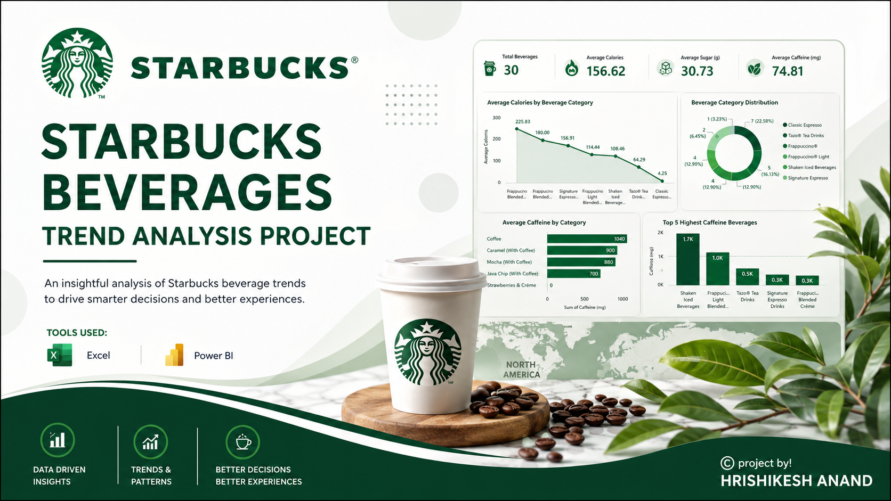
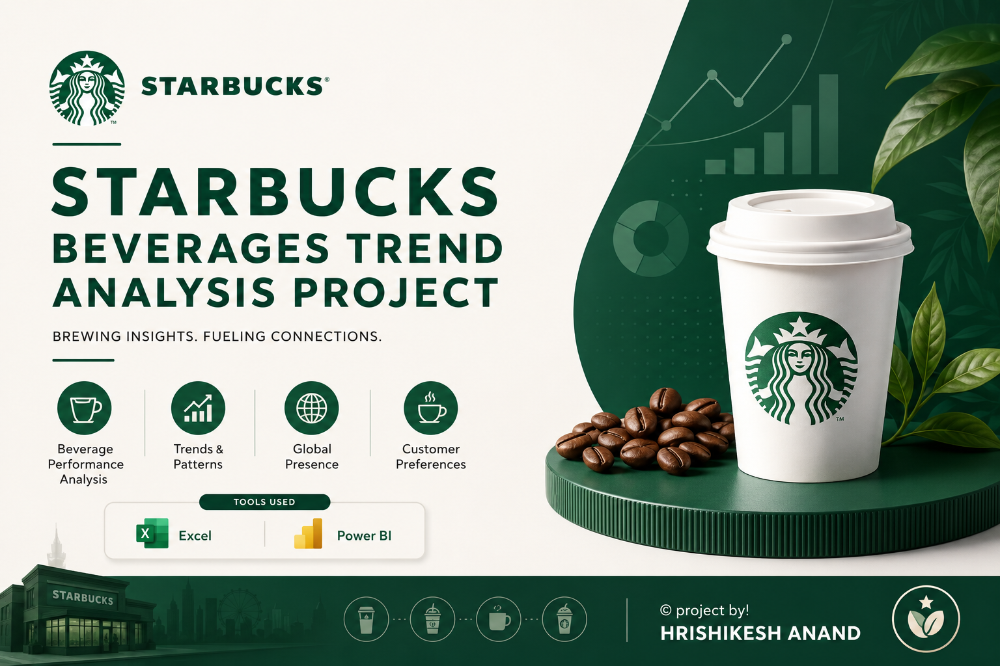
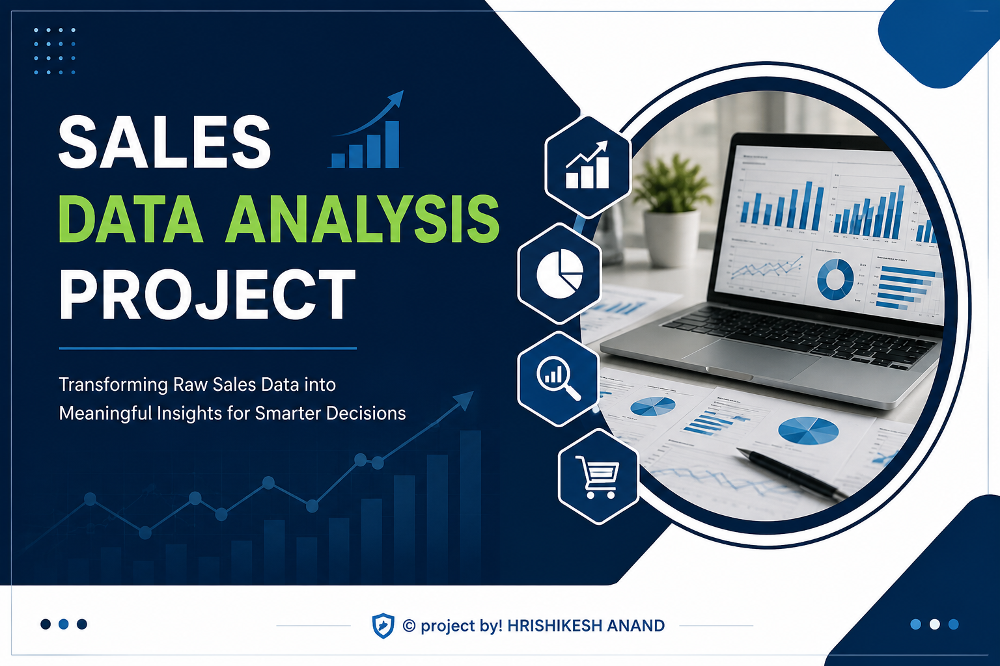
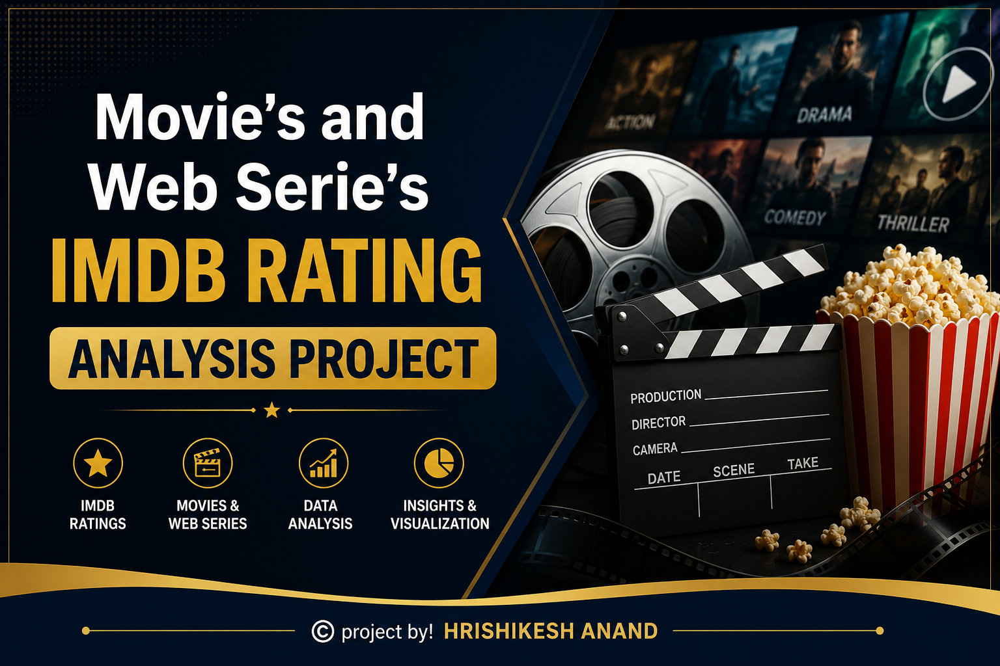

  

<table width="100%">
<tr>
<td>

<h2> 📓 About This Site </h2>

<h4> Welcom to my project directory website. </h4>  
Within this doccumantory website, the main focus is to display a proper tracking of my working projects and there respective presentation doccuments.
Below mentioned are the active projects links and there presentation doccuments.

</td>
</tr>
</table>

---

---

# 📍 Pin Project :-   
# [current updated project]

<h3> 📰 Project Name </h3> 
STARBUCKS BEVERAGES TRENDS ANALYSIS PROJECT.  

<h3> 📰 Description </h3>
This project mainly focuses on analysis of the trending beverages according to there nutritional insights. For better knowledge regarding this project doccument presentation, kindly click on the link provided....  

<h3> Tech. skills used; </h3>
- Excel (for data analysis)
- Power Bi (for dashboarding)
- other
- 

---

# 📒 Fourth Project :-   

<h3> 📰 Project Name </h3> 
STARBUCKS BEVERAGES TRENDS ANALYSIS PROJECT.  

<h3> 📰 Description </h3>
This project mainly focuses on analysis of the trending beverages according to there nutritional insights. For better knowledge regarding this project doccument presentation, kindly click on the link provided....  

<h3> Tech. skills used; </h3>
- Excel (for data analysis)
- Power Bi (for dashboarding)
- other
-

---

# 📒 Third Project :-   
# [current updated project]

<h3> 📰 Project Name </h3> 
SALE's DATA ANALYSIS PROJECT.  

<h3> 📰 Description </h3>
This project mainly focuses on analysis of the sales data for an electronic store. For better knowledge regarding this project doccument presentation, kindly click on the link provided....  

<h3> Tech. skills used; </h3>
- Excel
- other
- 

---

# 📒 Second Project :-   

<h3> 📰 Project Name </h3> 
IMDB RATING ANALYSIS FOR MOVIE's & WEB SERIE's.  

<h3> 📰 Description </h3>
This project mainly focuses on the IMDB rating data analysis between the year 2015 to 2025. This analysis represents the overall trends among the years. For better knowledge regarding this project doccument presentation, kindly click on the link provided....  

<h3> Tech. skills used; </h3>
- Excel
- other
- 

---

# 📒 First Project :-

<h3> 📰 Project Name :- </h3> 
TML SALES VOLUME DATA ANALYSIS PROJECT.  

<h3> 📰 Description :- </h3>
This project mainly focuses on the monthly passenger vehicle sales volume data analysis. This project contains a dummy dataset with the same conditions of a realtime sales data.
For better knowledge kindly click on the link below for the Project Presentation..... 

<h3> Tech. skills used; </h3>
- Excel 
- other
- 

---

  <a>
    <h4 style="color:#2563EB;">🛡️ © project by HRISHIKESH ANAND</h4>
  </a>

 
 

 
 

🛡️ Note on Data Source:  
The insights, visualizations, and models presented in this portfolio project are built entirely on simulated corporate data. This approach demonstrates an end-to-end project for data analysis workflows while fully protecting proprietary company information.

