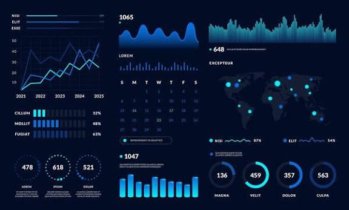
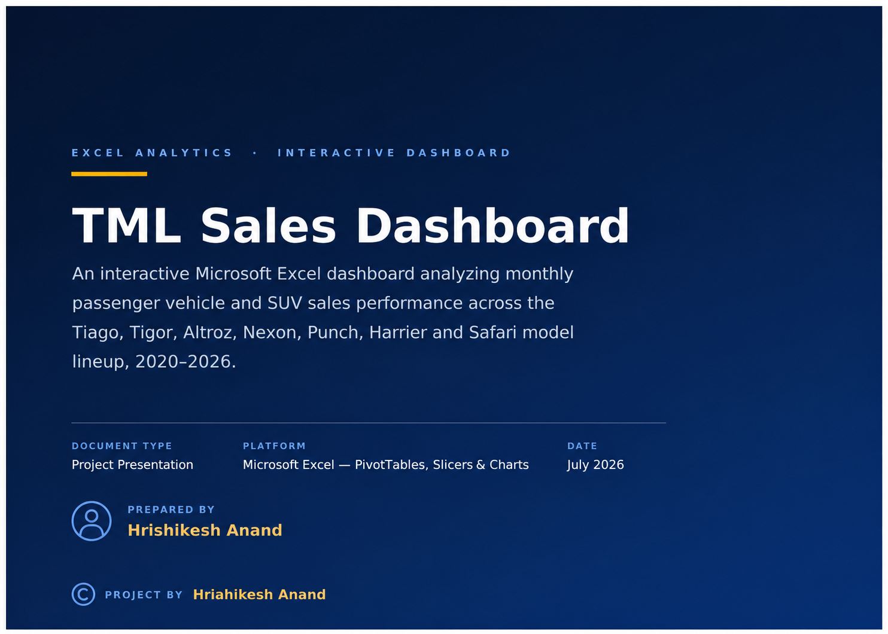

  

<table width="100%">
<tr>
<td>

<h2> 📌 About This Site </h2>

<h4> Welcom to my project directory website. </h4>  
Within this doccumantory website, the main focus is to display a proper tracking of my working projects and there respective presentation doccuments.
Below mentioned are the active projects links and there presentation doccuments.

</td>
</tr>
</table>

---

---

# 📒 Second Project :-  [current updated project]

<h3> Project Name </h3>  

<h3> Description </h3>
Describe your ongoing project.  

<h3> Tech. skills used; </h3>
- Python
- SQL
- Git

---

# 📒 First Project :-

<h3> Project Name </h3>  

<h3> Description </h3>
Describe your ongoing project.  

<h3> Tech. skills used; </h3>
- Python
- SQL
- Git

---

# © project by!  HRISHIKESH ANAND  

🛡️ Made with, dedication.... 

